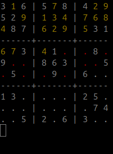
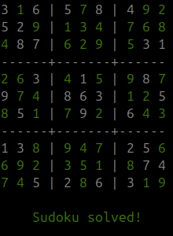
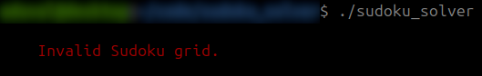

# sudoku_solver

## Overview

This is a C-based Sudoku solver that reads, solves, and displays Sudoku puzzles. The project features:

- **Grid Input**: Accepts Sudoku grids from text files or command-line input (in progress).
- **Puzzle Solving**: Uses a backtracking algorithm to solve Sudoku puzzles.
- **Grid Display**: Visually displays Sudoku grids with color-coded output to indicate progress and solutions.

## Features

- Interactive command-line interface for inputting and displaying Sudoku grids (in progress).
- Options for different solving speeds and display delays.

## Screenshots


### Solving the Sudoku Puzzle



The program progressively solves the Sudoku puzzle using a backtracking algorithm. The white characters represent the original numbers from the provided grid. The yellow numbers indicate the current value being tried by the solver. The red dots signify a deleted number, symbolizing a backtracking step where a previous guess was invalid.

### Sudoku Puzzle Solved



Once the puzzle is solved, the complete solution is displayed with the solved numbers in green.

### Invalid Sudoku Grid (in progress)



If the Sudoku grid is invalid, the program will output an error message indicating the grid cannot be solved.

## Installation

To compile and run the Sudoku solver, follow these steps:

1. **Clone the Repository**

   ```sh
   git clone https://github.com/ArthurDuval/sudoku_solver.git
   cd sudoku_solver
   ```
   
2. **Compile the Code**

   ```sh
   cc -o sudoku_solver header.h *.c
   ```

## Usage

Run the compiled program with the following command:

   ```sh
   ./sudoku_solver [option]
   ```

- **fast**: Solve the puzzle with quicker updates. This option speeds up the display updates for faster visualization of the solving process.
- **no_delay**: Solve the puzzle with no delay between steps. This option eliminates any delay, providing immediate updates as the puzzle is solved.

If no options are specified, the program will use the default speed setting with a delay of 300 milliseconds.

## File Input Format (in progress)

To provide a Sudoku grid through a text file, create a file (e.g., sudoku.txt) with the following format:

   ```sh
   3 0 6 5 0 8 4 0 0
   5 2 0 0 0 0 0 0 0
   0 8 7 0 0 0 0 3 1
   0 0 3 0 1 0 0 8 0
   9 0 0 8 6 3 0 0 5
   0 5 0 0 9 0 6 0 0
   1 3 0 0 0 0 2 5 0
   0 0 0 0 0 0 0 7 4
   0 0 5 2 0 6 3 0 0
   ```

The numbers represent the Sudoku grid, where 0 indicates an empty cell. Save this file in the same directory as the compiled program for input.
